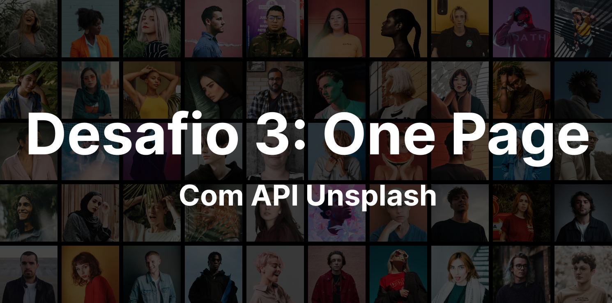

  
  

  
### 🚀 Technologies
- HTML5
- SASS/SCSS
- JavaScript
- [Unsplash API](https://unsplash.com/documentation)
- [Node Fetch](https://github.com/node-fetch/node-fetch)
- [FormSubmit](https://formsubmit.co/)
- [Google Fonts](https://fonts.google.com/)

### 💻 Project
Codelândia: One Page is a single page website concept. It was created so that all content is shown on the same page, with a unique layout and concentration of information in the same environment. The main objective is to bring dynamism and agility to user navigation.

Here is the deploy [link](https://desafio3-onepage.vercel.app/).

### 🔖 Layout
Here is the design [link](https://www.figma.com/file/Yb9IBH56g7T1hdIyZ3BMNO/Desafios---Codel%C3%A2ndia?node-id=3738%3A2) for that project.

### 📝 License
This project is under the MIT license. See the [file](LICENSE) for more details.

### 👍 Assignments
- Favicon: <a href="https://www.freepik.com" title="Freepik"> Freepik </a> from <a href="https://www.flaticon.com/" title="Flaticon">www.flaticon.com'</a>
